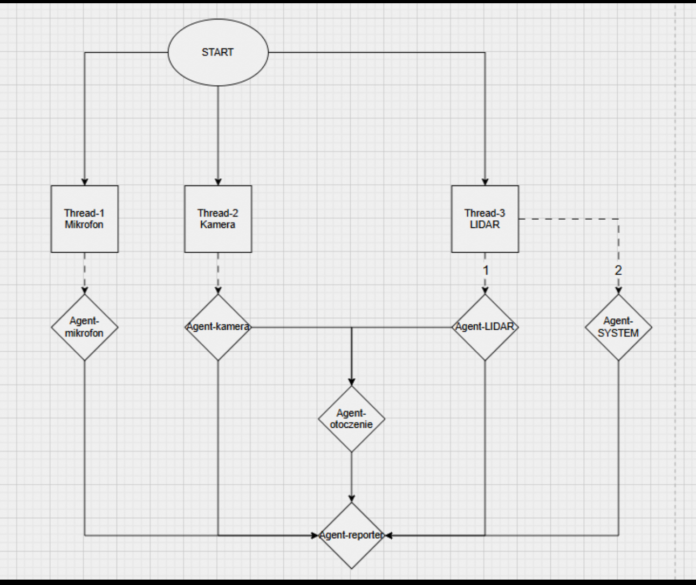

> **This repository is an archived snapshot.**
> It represents an earlier iteration of WATUS (AIWAT) and is preserved for reference.
> The current version is under active development and will be made public on release.

# WATUS – Voice Frontend (Watus + Reporter)

Low-latency voice frontend z rozpoznawaniem lidera (ECAPA / SpeechBrain), transkrypcją (Whisper via Faster-Whisper),
kolejką ZMQ oraz TTS (Piper). Łączy się z lokalnym backendem LLM (watus-ai) przez HTTP. **Kamera i jej pliki są obowiązkowe** – projekt korzysta z detekcji (Ultralytics RT-DETR/YOLO) i zapisuje kontekst do `camera.jsonl`.

<p align="center"> 
    
</p>

---

## 🚀 Szybka instalacja (macOS Intel 2019)

```bash
# 1. Klonowanie
git clone https://github.com/misialyna/watus_project.git
cd watus_project

# 2. Środowisko wirtualne
python3 -m venv .venv
source .venv/bin/activate

# 3. Instalacja z requirements.txt (wszystkie naprawy)
pip install -r requirements.txt

# 4. System dependencies (macOS)
brew install portaudio libsndfile espeak-ng

# 5. Model Piper TTS (63.2MB)
mkdir -p models/piper/voices
curl -L -o models/piper/voices/pl_PL-darkman-medium.onnx \
  "https://huggingface.co/rhasspy/piper-voices/resolve/v1.0.0/pl/pl_PL/darkman/medium/pl_PL-darkman-medium.onnx?download=true"
curl -L -o models/piper/voices/pl_PL-darkman-medium.onnx.json \
  "https://huggingface.co/rhasspy/piper-voices/resolve/v1.0.0/pl/pl_PL/darkman/medium/pl_PL-darkman-medium.onnx.json?download=true"

# 6. Test kompletny
python -c "
from piper import PiperVoice
import torch
print('✅ Piper TTS:', torch.__version__ if hasattr(torch, '__version__') else 'OK')
print('✅ Model Piper załadowany')
"

# 7. Uruchomienie
python watus.py
```

## 📋 Wymagania systemowe

- **Python 3.8-3.12** (zalecane Python 3.11)
- **macOS Intel** (2015+) lub Apple Silicon (M1/M2/M3) z Rosetta 2
- **macOS** - Homebrew wymagany
- **Linux** - Ubuntu 20.04+, Debian 11+
- **Windows** - Wymaga dodatkowej konfiguracji

## 🔧 Instalacja krok po kroku

### 1. Środowisko Python
```bash
# Tworzenie wirtualnego środowiska
python3 -m venv .venv
source .venv/bin/activate  # macOS/Linux
# .venv\Scripts\activate  # Windows

# Aktualizacja pip
pip install --upgrade pip
```

### 2. Piper TTS (nowy system)
```bash
# Główny system TTS
pip install piper-tts

# Test importu
python -c "from piper import PiperVoice; print('✅ Piper OK')"
```

### 3. Zależności systemowe

#### macOS (Intel/Apple Silicon)
```bash
# Wymagany Homebrew
brew install portaudio libsndfile espeak-ng

# Sprawdź instalację
brew list | grep -E "(portaudio|libsndfile|espeak-ng)"
```

#### Ubuntu/Debian
```bash
sudo apt update
sudo apt install portaudio19-dev libsndfile1-dev espeak-ng

# Sprawdź instalację
dpkg -l | grep -E "(portaudio|libsndfile|espeak-ng)"
```

### 4. Model Piper TTS
```bash
# Utwórz katalogi
mkdir -p models/piper/voices

# Pobierz model (WAŻNE: parametr ?download=true i wersja v1.0.0)
curl -L -o models/piper/voices/pl_PL-darkman-medium.onnx \
  "https://huggingface.co/rhasspy/piper-voices/resolve/v1.0.0/pl/pl_PL/darkman/medium/pl_PL-darkman-medium.onnx?download=true"

curl -L -o models/piper/voices/pl_PL-darkman-medium.onnx.json \
  "https://huggingface.co/rhasspy/piper-voices/resolve/v1.0.0/pl/pl_PL/darkman/medium/pl_PL-darkman-medium.onnx.json?download=true"

# Sprawdź rozmiary plików
ls -lh models/piper/voices/pl_PL-*
# Powinno być: 63.2 MB (onnx) i 4.82 kB (json)
```

### 5. Zależności Python
```bash
# Pełna instalacja z naprawionymi wersjami
pip install -r requirements.txt

# Test komponentów
python -c "
import torch, torchaudio, torchvision, piper
print('✅ PyTorch:', torch.__version__)
print('✅ Piper TTS: załadowany')
"
```

## ⚙️ Konfiguracja

### Plik .env
Utwórz plik `.env` z podstawowymi ustawieniami:

```bash
# TTS - Nowy system Python API
PIPER_MODEL_PATH=models/piper/voices/pl_PL-darkman-medium.onnx
PIPER_SAMPLE_RATE=22050

# STT - Rozpoznawanie mowy
STT_PROVIDER=local
WHISPER_MODEL=guillaumekln/faster-whisper-small
WHISPER_DEVICE=cpu
WHISPER_COMPUTE=int8

# Wake words
WAKE_WORDS=hej watusiu,hej watuszu,hej watusił,kej watusił,hej watośiu

# Audio
WATUS_SR=16000
WATUS_BLOCKSIZE=160
```

## 🧪 Sprawdzenie instalacji

### Szybki test Piper
```bash
# Sprawdź czy model istnieje
ls -la models/piper/voices/pl_PL-darkman-medium.*

# Test API
python -c "
from piper import PiperVoice
import tempfile
import os

# Test ładowania modelu
voice = PiperVoice.load('models/piper/voices/pl_PL-darkman-medium.onnx')
print('✅ Model załadowany')

# Test syntezy
with tempfile.NamedTemporaryFile(suffix='.wav', delete=False) as tmp:
    voice.synthesize('Test polskiego głosu', tmp.name)
    if os.path.exists(tmp.name) and os.path.getsize(tmp.name) > 1000:
        print('✅ Synteza audio działa')
        os.unlink(tmp.name)
    else:
        print('❌ Błąd syntezy')
"
```

### Sprawdź urządzenia audio
```bash
# Lista urządzeń audio
python -c "
import sounddevice as sd
devices = sd.query_devices()
print('Urządzenia audio:')
for i, dev in enumerate(devices):
    print(f'{i}: {dev[\"name\"]} (in:{dev[\"max_input_channels\"]}, out:{dev[\"max_output_channels\"]})')
"
```

### Test Watus
```bash
# Uruchom i przetestuj
python watus.py
# Powiedz: 'hej watusiu jak się masz'
```

### Szybki test przed uruchomieniem
```bash
# Test Piper API
python -c "from piper import PiperVoice; voice = PiperVoice.load('models/piper/voices/pl_PL-darkman-medium.onnx'); print('✅ Piper gotowy!')"

# Test audio
python -c "import sounddevice as sd; print(f'Urządzenia audio: {len(sd.query_devices())} znalezione')"
```

## 🔧 Rozwiązywanie problemów

### Problem: "Piper Python API nie dostępne"
```bash
# Reinstaluj Piper
pip uninstall piper-tts
pip install piper-tts

# Sprawdź instalację
python -c "import piper; print('Piper OK')"
```

### Problem: "ModelProto does not have a graph"
**Przyczyna:** Błędne pobranie modelu ONNX  
**Rozwiązanie:**
```bash
# Usuń błędny model
rm -f models/piper/voices/pl_PL-darkman-medium.onnx

# Pobierz ponownie z parametrem ?download=true i wersją v1.0.0
curl -L -o models/piper/voices/pl_PL-darkman-medium.onnx "https://huggingface.co/rhasspy/piper-voices/resolve/v1.0.0/pl/pl_PL/darkman/medium/pl_PL-darkman-medium.onnx?download=true"

# Test modelu
python -c "
from piper import PiperVoice
voice = PiperVoice.load('models/piper/voices/pl_PL-darkman-medium.onnx')
print('✅ Model załadowany poprawnie!')
"
```

### Problem: "Error opening '/var/folders/.../tmp.wav': Format not recognised"

**Przyczyna:** Stare API piper-tts zostało zmienione w wersji 1.3.0
```
PIPER_VOICE.synthesize(text, wav_path)  # Stare API - nie działa
```

**Rozwiązanie:** Zaktualizowano watus.py do nowego API:
```bash
# Nowe API - AudioChunk iterator
audio_data = []
for chunk in PIPER_VOICE.synthesize(text):
    if isinstance(chunk, AudioChunk):
        chunk_data = chunk.audio_int16_array.astype(np.float32) / 32768.0
        audio_data.append(chunk_data)
full_audio = np.concatenate(audio_data)
```

**Test naprawy:**
```bash
python -c "
from piper import PiperVoice, AudioChunk
import numpy as np

voice = PiperVoice.load('models/piper/voices/pl_PL-darkman-medium.onnx')
audio_chunks = list(voice.synthesize('Test naprawy API'))
print(f'✅ API naprawione: {len(audio_chunks)} chunks wygenerowanych')
if audio_chunks:
    chunk = audio_chunks[0]
    print(f'✅ AudioChunk: {len(chunk.audio_int16_array)} próbek')
"
```

### Problem: "Permission denied" na macOS
```bash
# Sprawdź uprawnienia
ls -la models/piper/voices/

# Dla binary fallback (opcjonalne)
chmod +x models/piper/piper 2>/dev/null || echo "Binary nie istnieje - OK z nowym API"
```

### Problem: Audio input/output
```bash
# Sprawdź urządzenia audio
python -c "import sounddevice as sd; print(sd.query_devices())"

# Ustaw urządzenia w .env
WATUS_INPUT_DEVICE=1  # Indeks mikrofonu
WATUS_OUTPUT_DEVICE=2 # Indeks głośników
```

### Problem: Błędy importu bibliotek
```bash
# Test kluczowych importów
python -c "
try:
    from piper import PiperVoice
    print('✅ Piper: OK')
except ImportError as e:
    print(f'❌ Piper: {e}')

try:
    import sounddevice as sd
    print('✅ SoundDevice: OK')
except ImportError as e:
    print(f'❌ SoundDevice: {e}')

try:
    from faster_whisper import WhisperModel
    print('✅ Faster-Whisper: OK')
except ImportError as e:
    print(f'❌ Faster-Whisper: {e}')
"

# Naprawa błędów
pip install --upgrade numpy sounddevice soundfile faster-whisper
```

### Problem: "ERROR: Could not find a version that satisfies the requirement torch==2.4.0"
**Przyczyna:** PyTorch 2.4.0 nie jest dostępny w Twoim środowisku  
**Rozwiązanie:** Użyj kompatybilnych wersji
```bash
# Pobierz poprawiony requirements.txt (z workspace)
# Lub zaktualizuj wersje ręcznie:
# torch==2.2.2  (było 2.4.0)
# torchaudio==2.2.2  (było 2.4.0)
# torchvision==0.17.2  (było 0.19.0)

# Zainstaluj
pip install torch==2.2.2 torchaudio==2.2.2 torchvision==0.17.2

# Test PyTorch
python -c "import torch; print(f'Torch: {torch.__version__}')"
```

### Problem: Niezgodne wersje pakietów
```bash
# Sprawdź wersje
pip list | grep -E "(torch|sound|piper|onnx)"

# Naprawa kompatybilności
pip install "torch>=2.1.0,<2.7.0" "onnxruntime>=1.0,<2.0" "piper-tts>=1.3.0"
```

### Problem: "ResolutionImpossible" - konflikt psutil
**Przyczyna:** Dwie sprzeczne wersje psutil w requirements.txt  
**Rozwiązanie:** Ujednolica wersje
```bash
# Sprawdź duplikaty
grep "psutil==" requirements.txt

# Napraw - jedna wersja w obu miejscach:
# psutil==7.1.0  (linie 56 i 122)
sed -i 's/psutil==5.9.8/psutil==7.1.0/g' requirements.txt

# Reinstaluj
pip install -r requirements.txt
```

### Problem: Błędy systemowe (macOS)
```bash
# Sprawdź Homebrew
brew --version
brew list | grep -E "(portaudio|libsndfile|espeak-ng)"

# Reinstalacja jeśli potrzeba
brew reinstall portaudio libsndfile espeak-ng
```

## 🚀 Uruchomienie

### Pełny stack (4 terminale)
```bash
# Terminal 1: LLM Backend (watus-ai repo)
uvicorn src.main:app --host 127.0.0.1 --port 8000 --reload

# Terminal 2: Reporter
python reporter.py

# Terminal 3: Kamera (OBOWIĄZKOWA)
python camera_runner.py --jsonl ./camera.jsonl --device 0 --rt 1

# Terminal 4: Watus (główny)
python watus.py
```

### Test tylko Piper TTS
```bash
# Szybki test bez pełnego stack'a
python test_piper.py
```

## 📊 Architektura systemu

### Komponenty główne:
- **watus.py** - Frontend audio (VAD, STT, Speaker ID, TTS)
- **reporter.py** - ZMQ subscriber + LLM backend
- **camera_runner.py** - Computer vision (obowiązkowy)
- **Piper TTS** - Nowy Python API dla syntezy mowy
- **Faster-Whisper** - Local STT
- **SpeechBrain/ECAPA** - Speaker verification

### Workflow:
```
Wake Word → VAD → STT → Speaker Verification → LLM → TTS → Playback
```

### ZMQ Komunikacja:
- **PUB:** `dialog.leader` (tcp://127.0.0.1:7780) - wysyła lidera
- **SUB:** `tts.speak` (tcp://127.0.0.1:7781) - odbiera TTS
- **HTTP:** LLM backend na porcie 8000

## 🎯 Zastosowania

- **Asystent głosowy** dla Raspberry Pi
- **Kiosk informacyjny** z głosową obsługą  
- **Smart home controller** z weryfikacją głosu
- **Centrum dowodzenia** głosowego
- **Edukacyjne aplikacje** interaktywne

## 📋 Wake Words

Domyślne słowa aktywacji:
- `hej watusiu`
- `hej watuszu` 
- `hej watusił`
- `kej watusił`
- `hej watośiu`

### Zmiana wake words
```bash
# W pliku .env
WAKE_WORDS=hej watusiu,hello watus,przywitanie
```

## 🤝 Wsparcie

### Diagnostyka szybka:
```bash
# Uruchom skrypt diagnostyczny
python install_watus.py

# Sprawdź logi
tail -f watus.log 2>/dev/null || echo "Log nie istnieje"
```

### Wysyłanie błędów:
- Błędy modelu ONNX: sprawdź `?download=true` w URL
- Błędy audio: sprawdź `sounddevice.query_devices()`
- Błędy importu: reinstaluj pakiety z `pip install -r requirements.txt`

### Diagnostyka audio:
```bash
# Lista urządzeń audio
python -c "
import sounddevice as sd
devices = sd.query_devices()
for i, dev in enumerate(devices):
    print(f'{i}: {dev[\"name\"]} (max_in:{dev[\"max_input_channels\"]}, max_out:{dev[\"max_output_channels\"]})')
"
```
